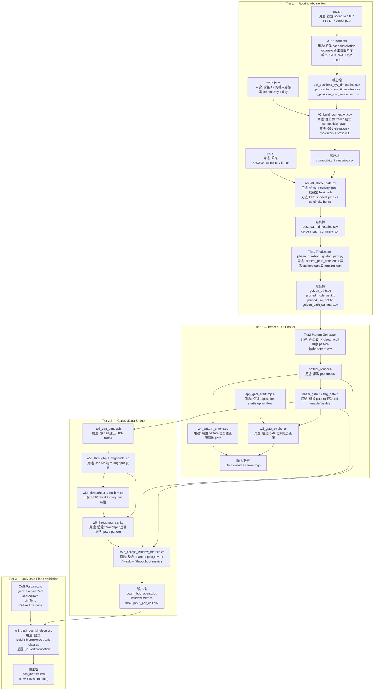

# 系統分層
```
Routing abstraction      → Tier1:LEO 動態路由不穩定
Resource control         → Tier2:有限 beam / resource allocation； Tier2.5:control plane 是否真的影響 traffic
Data plane verification  → Tier3 :QoS policy 是否成立
```
# 資料流
```
LEO Scenario
      │
      ▼
Tier1-A1  Position Timeseries
      │
      ▼
Tier1-A2  Connectivity Graph
      │
      ▼
Tier1-A3  Stable Path Selection
      │
      ▼
Tier1-B   Golden Path / Pruned Set
      │
      ▼
Tier2     Beam/Cell Time Pattern
      │
      ▼
Tier2.5   Window / Gate / Throughput validation
      │
      ▼
Tier3     QoS traffic validation
```
# I/O
## tier 1
###  Node position timeseries
[sat-constellation-example]()

輸出:
- sat_positions_xyz_timeseries.csv
- gw_positions_xyz_timeseries.csv
- ut_positions_xyz_timeseries.csv

###  build connectivity graph
[build_connectivity.py]()

[meta.json]()

輸出:
- connectivity_timeseries.csv
 - head:time_sec, src, dst, edge_type

### SRC_NODE → DST_NODE:最穩路徑
`score = -hop_count + continuity_bonus`
[a3_stable_path.py]()

輸入:
connectivity_timeseries.csv

輸出:
- best_path_timeseries.csv
- golden_path_summary.json

### Routing abstraction finalization
[phase_b_extract_golden_path.py]()

輸出:
- golden_path.txt
- pruned_node_set.txt
- pruned_link_set.txt

# tier 2
時間: 服務 cell → gate enable / disable
pattern:
```
t_us, cell, enabled
0,A,1
5000,A,0
5000,B,1
```
驗證 gate:[w3_gate_smoke.cc]()
驗證 pattern reader:[w4_pattern_smoke.cc]()

## tier 2.5 Window Metrics
Control plane → Data plane bridge
[w25_tier2p5_window_metrics.cc]()
輸出:
- beam_hop_events.log
- throughput_per_cell.csv
- window_metrics.csv

## tier 3 QoS Validation
建立 traffic classes：Gold/Silver/Bronze
[w3_tier3_qos_singlecell.cc]()

輸出:
- qos_metrics.csv

# Flow chart

