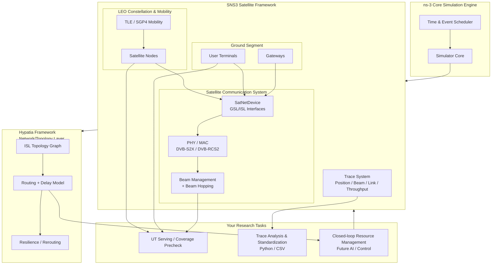

# SNS3/ns-3 LEO Experimental Environment Architecture (Long-term)

---
- LEO mobility: defined by SNS3 mobility model (SGP4/TLE).
- SatNetDevice: networking interface for satellite links (enables communication experiments).
- Beam Hopping: beam activation scheduling + capacity shifting over time.
- Hypatia: ISL/routing/delay/resilience, typically network/topology layer.

## Goal
- **SatNetDevice / PHY/MAC** (end-to-end comms)
- **Beam Hopping**
- **Hypatia** (ISL routing/resilience)

## Phase 1
## Phase 1 — SNS3-native LEO Constellation (Mobility only; no comms)

### Task 1.1 — Instantiate LEO satellites using SNS3 (SGP4/TLE)
**Objective:** LEO constellation is created by SNS3 framework (not custom orbit code).

**Deliverables**
- Dataset inputs
  - `datasets/constellation/tles.txt`
  - `datasets/constellation/start_date.txt`
- Output traces (native or exported)
  - `results/p1_leo_mobility/traces/positions_raw.*`
  - OR standardized CSV (see Task 1.2)

**Verification**
- Show a time-series position trace exists and varies over time.

**DoD**
- Positions come from SNS3 mobility (SGP4/TLE) and are reproducible across reruns.

---

### Task 1.2 — Standardize position traces to a common CSV format
**Objective:** Create a stable interface for downstream tasks (coverage/beam/routing).

**Standard output format**
`time,nodeId,lat,lon,alt`

**Deliverables**
- `analysis/positions_to_csv.py` (or equivalent)
- `results/p1_leo_mobility/traces/leo_positions.csv`
- `results/p1_leo_mobility/logs/run.log`

**Verification (example)**
- Longitude range should be clearly > 0 for at least one satellite:
  - `lon_range_deg` computed from CSV.

**DoD**
- CSV is generated deterministically and used as the canonical mobility artifact.

---

## Phase 2 — UT/GW Presence + Coverage/Serving Sanity (No traffic)

### Task 2.1 — Add UT/GW nodes into the SNS3 scenario (still no comms)
**Objective:** Ground segment exists; geometry is meaningful.

**Deliverables**
- `results/p2_ut_gw_setup/traces/ut_positions.*`
- `results/p2_ut_gw_setup/traces/gw_positions.*`
- `results/p2_ut_gw_setup/logs/run.log`

**DoD**
- UT/GW nodes are instantiated and traceable over time.

---

### Task 2.2 — UT Serving / Coverage precheck
**Objective:** Validate “who can serve whom” before enabling SatNetDevice/traffic.

**Deliverables**
- `analysis/ut_serving_precheck.py`
- `results/p2_ut_serving_precheck/serving_timeline.csv`
  - Example columns: `time,utId,satId,beamId,reason`
- A short report snippet:
  - how many UTs are served at each time step
  - how many are unserved (and why)

**DoD**
- Serving results are explainable and consistent with geometry.

---

## Phase 3 — Minimal Communication Skeleton (Introduce SatNetDevice)

### Task 3.1 — Install SatNetDevice in SNS3 scenario (minimal)
**Objective:** Communication pipeline exists; not optimizing performance yet.

**Deliverables**
- `results/p3_satnetdevice_min/logs/run.log`
- Basic link trace or counters:
  - `results/p3_satnetdevice_min/traces/link_stats.*`

**DoD**
- Simulation runs end-to-end with SatNetDevice enabled.

---

### Task 3.2 — End-to-end sanity flow (1 flow is enough)
**Objective:** Prove the comms stack is functional (UT ↔ GW).

**Deliverables**
- Minimal traffic config (documented)
- Rx/Tx proof:
  - packet sink received logs
  - throughput counter (even small)

**DoD**
- At least one flow successfully traverses UT↔Sat↔GW.

---

## Phase 4 — Beam & Beam Hopping (SNS3-native)

### Task 4.1 — Fixed-beam baseline
**Objective:** Establish baseline behavior before hopping.

**Deliverables**
- `results/p4_fixed_beam/logs/run.log`
- Beam/serving trace(s)

**DoD**
- Beam selection is stable and explainable.

---

### Task 4.2 — Enable Beam Hopping + verify switching timeline
**Objective:** Beam activation changes over time as configured.

**Deliverables**
- `results/p4_beam_hopping/traces/beam_active_timeline.csv`
  - Example columns: `time,beamId,state`
- Evidence of:
  - switch period matches config
  - no unexpected overlap/idle gaps (unless intentionally configured)

**DoD**
- Beam hopping behavior is deterministic across reruns (or documented if stochastic).

---

## Phase 5 — Hypatia Integration (ISL Routing / Resilience)

### Task 5.1 — Hypatia dataset generation aligned with SNS3 constellation
**Objective:** Same constellation basis, consistent epoch/time.

**Deliverables**
- `results/p5_hypatia_dataset/` containing:
  - `isls.txt`, `gsls.txt`, `routes.txt` (or Hypatia-equivalent)
- Validation:
  - basic reachability and delay sanity checks

**DoD**
- Dataset is reproducible and aligned to SNS3 constellation config.

---

### Task 5.2 — Cross-layer experiments (SNS3 Beam + Hypatia Routing)
**Objective:** Evaluate realistic scenarios: routing reacts to ISL dynamics while SNS3 models link/beam behavior.

**Deliverables**
- Experiment definition document
- Results folder with:
  - routing outputs
  - beam/link traces
  - analysis plots (if needed)

**DoD**
- The experiment demonstrates a coupled behavior that cannot be shown by either framework alone.

---

## Phase 6 — Closed-loop Control / AI (Future)
**Objective:** Use traces and routing models to implement adaptive resource management.

**Deliverables**
- Control loop design doc
- Dataset + training/evaluation logs
- Baseline vs controlled comparison

**DoD**
- Closed-loop improves a defined KPI under controlled scenarios, with reproducible evidence.

